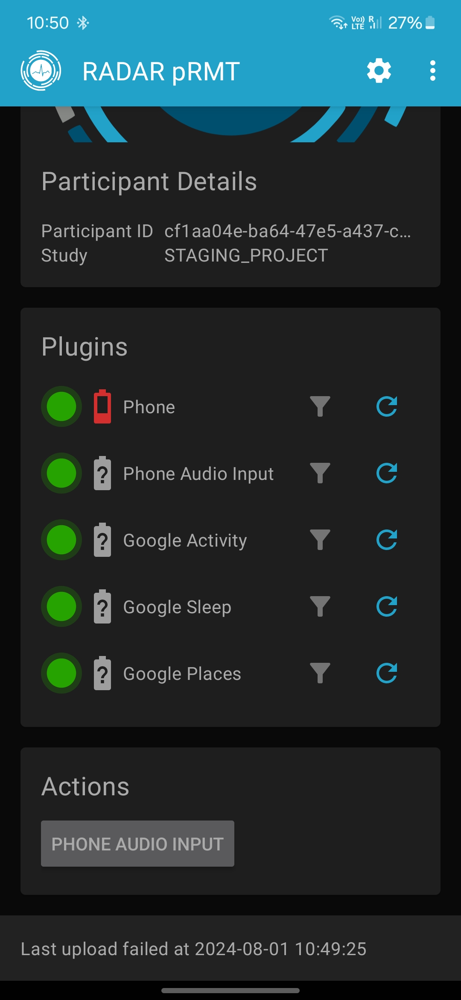
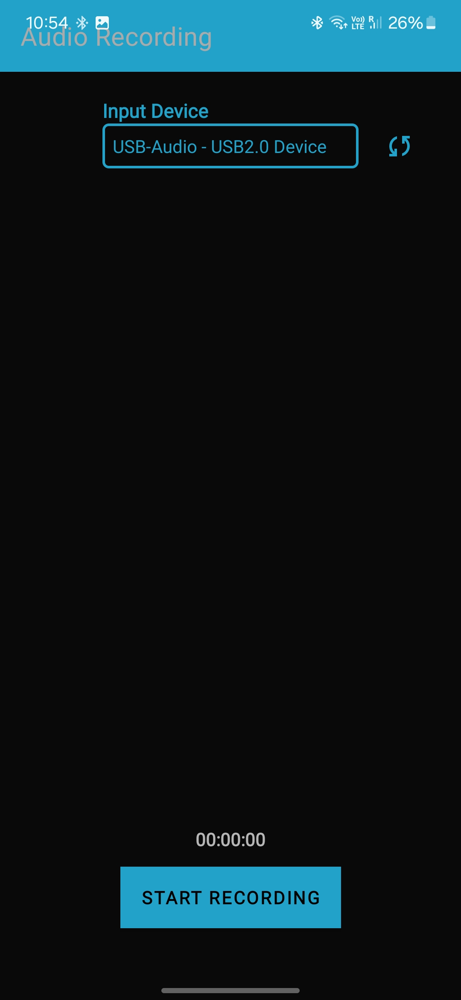
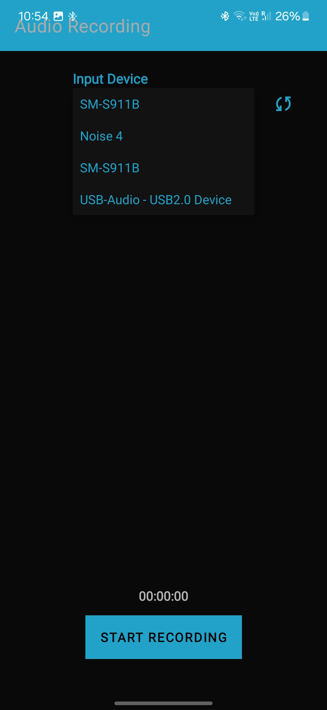
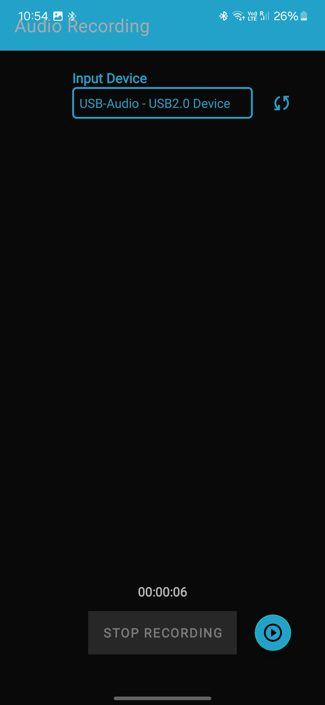
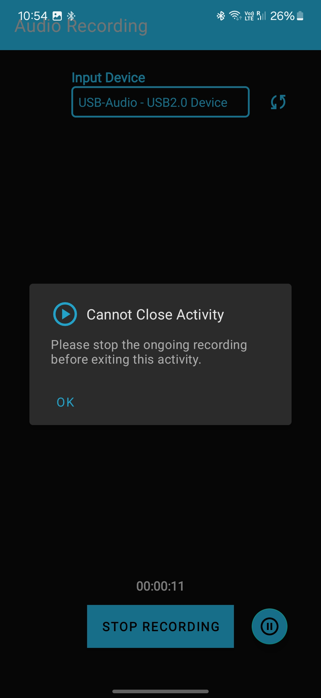
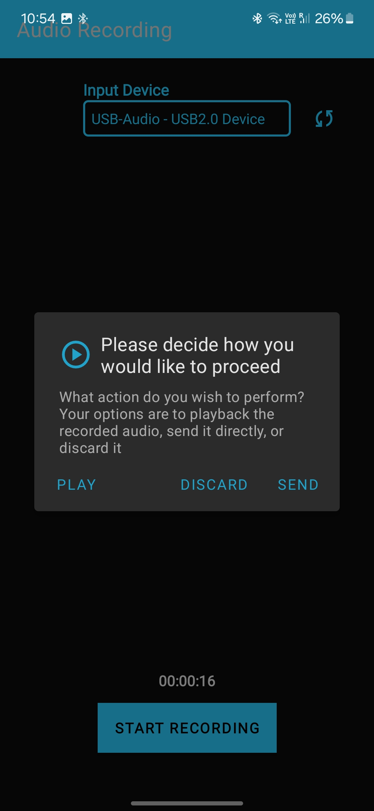
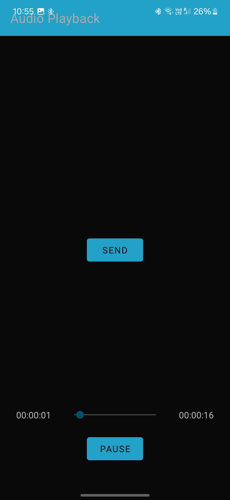
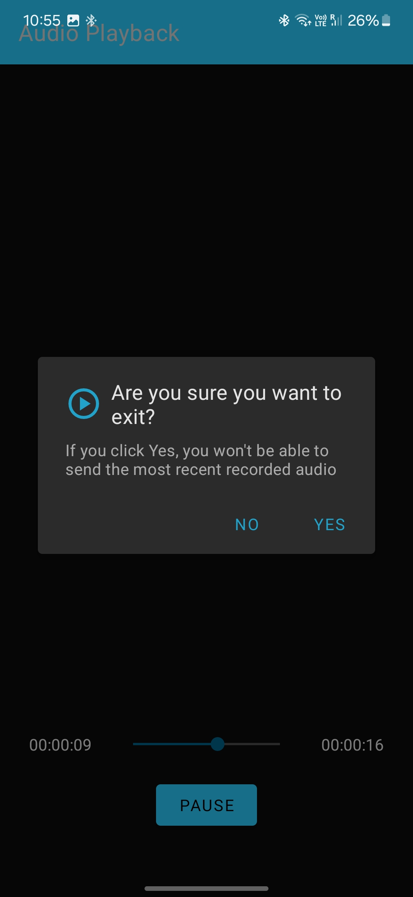

# RADAR PHONE AUDIO INPUT

Plugin for recording uncompressed high-quality audio, utilizing low-level classes to directly interact with hardware, with capabilities for playback and audio input device selection.


## Installation

Include this plugin in a RADAR app by adding the following configuration to `build.gradle`:
```gradle
dependencies {
    implementation "org.radarbase:radar-android-phone-audio-input:$radarCommonsAndroidVersion"
}
```
Add the provider `org.radarbase.passive.phone.audio.input` to the `plugins` variable of the `RadarService` instance in your app.

## Configuration

To enable this plugin, add the provider `phone_audio_input` to `plugins` property of the configuration.

This plugin takes the following Firebase configuration parameters:


| Name                                     | Type | Default                              | Description                                                                                                                                                                                                                                                                                                                                                                                                                                                |
|------------------------------------------|------|--------------------------------------|------------------------------------------------------------------------------------------------------------------------------------------------------------------------------------------------------------------------------------------------------------------------------------------------------------------------------------------------------------------------------------------------------------------------------------------------------------|
| `phone-audio-input-audio-source`         | int  | `1` = MediaRecorder.AudioSource.MIC  | Specifies the source of audio input for recording. The default value is 1, which corresponds to MediaRecorder.AudioSource.MIC. This means the application will use the device's microphone for audio input.                                                                                                                                                                                                                                                |
| `phone-audio-input-recorder-buffer-size` | int  | `-1`                                 | Defines the size of the buffer used by the audio recorder. The buffer is a temporary storage area for audio data before it is processed or saved. Setting this to -1 lets the system choose an optimal buffer size based on the current audio configuration. Adjusting this can impact audio latency and quality.                                                                                                                                          |
| `phone-audio-input-current-audio-format` | int  | `2` = AudioFormat.ENCODING_PCM_16BIT | Determines the encoding format of the recorded audio. The default value 2 corresponds to AudioFormat.ENCODING_PCM_16BIT, which means the audio will be recorded in 16-bit Pulse Code Modulation (PCM). PCM is a common uncompressed audio format that provides high-quality sound. Other formats like 8-bit PCM can also be used, but they may reduce audio quality. Note that 8-bit encoding might not work on all devices, so 16-bit should be preferred |
| `phone-audio-input-current-channel`      | int  | `0x10` = 16                          | Specifies the number of audio channels to be used during recording. The default value 0x10 represents mono (1 channel), meaning audio will be recorded from a single channel. Using mono recording is typical for voice recording to save space and simplify processing. Stereo (2 channels) can also be used for higher quality audio that captures a sense of direction.                                                                                 |
| `phone-audio-input-current-sample-rate`  | int  | `16000`                              | Defines the number of audio samples captured per second. The default value is 16000 Hz (16 kHz), which is a common sample rate for voice recording, balancing audio quality and file size. Higher sample rates, such as 44100 Hz (CD quality), provide better audio fidelity but result in larger file sizes. Lower sample rates may be used for lower quality or reduced file size needs.                                                                 |


This plugin produces data for the following topics: (types starts with `org.radarcns.passive.google` prefix)

| Topic                       | Type              | Description                                                                                                                                                                                                                              |
|-----------------------------|-------------------|------------------------------------------------------------------------------------------------------------------------------------------------------------------------------------------------------------------------------------------|
| `android_phone_audio_input` | `PhoneAudioInput` | This topic captures high-quality, uncompressed audio data recorded by the user's device. The PhoneAudioInput type includes detailed information about the audio recording, such as timestamps, file metadata, and device specifications. |

## Workflow Description

This plugin provides an interactive UI for recording and managing audio data. Below is a detailed description of how the plugin works:

### Workflow

1. **Plugin Action**:
    - The plugin has an action that, when clicked, opens a user interface (UI) for interacting with the plugin.

2. **Activity Launch**:
    - The action opens the `PhoneAudioInputActivity`, which serves as the main interface for the plugin.

3. **Manager Connection**:
    - `PhoneAudioInputActivity` is connected to the `PhoneAudioInputManager` through interfaces defined in `PhoneAudioInputState`. This connection manages the state and interactions between the UI and the underlying audio recording functionalities.

4. **Recording Capabilities**:
    - The activity provides capabilities for recording audio, allowing users to start, stop, and manage audio recordings directly from the UI.

5. **Device Selection Mechanism**:
    - The device selection mechanism automatically prioritizes the USB audio device if connected. If no USB device is found, the plugin selects external devices in the following order of precedence:
        - `TYPE_USB_DEVICE`
        - `TYPE_WIRED_HEADSET`
        - `TYPE_BLUETOOTH`
     - If no external device is found, the plugin defaults to using the smartphone's built-in microphone.

6. **Fragment Integration**:
    - `PhoneAudioInputActivity` opens a fragment that provides additional capabilities, including:
        - **Audio Playback**: Users can playback the recorded audio to review it before sending.
        - **Data Sending**: Users can send the recorded audio data for storing to s3.

### Guide for Using the PhoneAudioInput Plugin
<br>


<br>
1. In the main activity, where plugins are visible along with their actions (if any), click on the specific action for the Phone Audio Input plugin.
   - This will redirect you to the first activity of the Phone Audio Input plugin.
<br>


<br>
2. At the top of this activity, there is a dropdown menu for selecting microphones.
   - The current input routing microphone is shown by default in the dropdown menu when it is collapsed.
   - Click on the refresh button near dropdown menu to refresh microphones.
   - Select your preferred microphone from the dropdown menu. If no preferred microphone is selected, the automatic device selection logic will take place.
<br>


<br>
3. Click Start Recording to begin recording audio.
   - While recording, you can pause or resume the recording.
   - Do not quit the recording activity while recording is in progress or paused, as this may cause the application to misbehave. An alert will also be shown if you attempt to quit the activity in a recording or paused state. You can safely quit the activity after stopping the recording.
<br>


<br>
4. After stopping the recording, an alert dialog will appear with three options: play the recorded audio, send it directly without playing, or discard it.
   - If you click Play, you will be redirected to a new fragment for listening to the last recorded audio. Here, you can review the recording and send it after listening.

   
